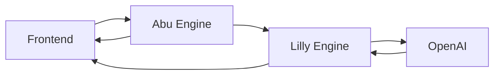

# AI Oracle - Technical Documentation

## Project Structure

### 1. Abu Engine (`/abu_engine`)
```
abu_engine/
├── Dockerfile
├── main.py              # FastAPI backend for astrological calculations
├── requirements.txt     # Python dependencies
├── core/               # Core astrological computation modules
│   ├── aspects.py      # Planetary aspect calculations
│   ├── chart.py        # Birth chart generation
│   ├── forecast.py     # Time series forecasting
│   ├── houses.py       # House system calculations
│   ├── life_cycles.py  # Major life cycle events
│   └── scoring.py      # Astrological scoring system
└── data/
    ├── cities.json     # City coordinates database
    └── de440s.bsp     # JPL ephemeris data
```

### 2. Lilly Engine (`/lilly_engine`)
```
lilly_engine/
├── Dockerfile
├── main.py             # FastAPI backend for AI interpretation
├── requirements.txt    # Python dependencies
├── archetypes.json    # Astrological interpretation templates
├── core/
│   └── llm.py         # OpenAI integration and prompt management
└── data/
    └── memory.json    # Conversation memory storage
```

### 3. Frontend (`/next_app`)
```
next_app/
├── Dockerfile
├── app/
│   ├── chart/        # Birth chart visualization
│   ├── forecast/     # Forecast timeline view
│   └── interpret/    # Interpretation display
├── components/
│   ├── LillyPanel.tsx  # Interpretation display component
│   └── Navigation.tsx  # Site navigation
└── styles/
    └── globals.css     # Tailwind and custom styles
```

## Endpoints and APIs

### Abu Engine (Port 8000)

1. `/api/astro/chart` (GET)
   - Calculates birth chart positions
   - Params: `date` (ISO), `lat`, `lon`
   - Returns: Planet positions, aspects, houses

2. `/api/astro/forecast` (GET)
   - Generates astrological forecasts
   - Params: `birthDate`, `lat`, `lon`, `start`, `end`
   - Returns: Time series and peak events

3. `/api/astro/life-cycles` (GET)
   - Identifies major life cycles
   - Params: `birthDate`
   - Returns: Saturn returns, Uranus oppositions, etc.

### Lilly Engine (Port 8001)

1. `/api/ai/interpret` (POST)
   - Generates AI interpretations
   - Input: Astrological event data
   - Returns: Headline, narrative, actions
   - Features: Multilingual (ES/EN), fallback to archetypes

## Environment and Configuration

### Environment Variables
```bash
# Abu Engine
EPHEMERIS_PATH=/app/data/de440s.bsp

# Lilly Engine
OPENAI_API_KEY=sk-...
DEFAULT_LANGUAGE=ES
MAX_TOKENS=500

# Frontend
NEXT_PUBLIC_ABU_URL=http://localhost:8000
NEXT_PUBLIC_LILLY_URL=http://localhost:8001
```

## OpenAI Integration

- Model: GPT-4 (fallback to GPT-3.5-turbo)
- Temperature: 0.9
- Max tokens: 500
- Response format: Structured JSON with:
  - headline
  - narrative
  - actions
  - astro_metadata

## Latest Features Added

1. Conversation Memory
   - Stores last 5 interpretations per user
   - FIFO queue implementation
   - Context injection in prompts

2. Chart Visualization
   - D3.js for zodiac wheel
   - Aspect lines display
   - House cusps rendering

3. Multilingual Support
   - Spanish (default)
   - English support
   - Language-specific prompts

4. Frontend Improvements
   - React Markdown rendering
   - Tailwind styling
   - Mobile responsiveness

## Dependencies

### Abu Engine
```python
fastapi>=0.68.0
uvicorn>=0.15.0
skyfield>=1.39.0
numpy>=1.21.0
pandas>=1.3.0
```

### Lilly Engine
```python
fastapi>=0.68.0
openai>=0.28.0,<1.0.0
pydantic>=1.8.0
```

### Frontend
```json
{
  "next": "15.0.0",
  "react": "18.2.0",
  "d3": "7.x",
  "typescript": "5.x",
  "tailwindcss": "3.x"
}
```

## Data Flow



## Frontend Routes

1. `/chart`
   - Birth chart visualization
   - Input form for date/location
   - Aspect display toggle

2. `/forecast`
   - Timeline visualization
   - Peak/valley detection
   - Date range selection

3. `/interpret`
   - AI interpretation display
   - Markdown rendering
   - Action items list

## Known Limitations

1. Abu Engine
   - Limited to specific date range (1950-2050)
   - Single location per request

2. Lilly Engine
   - API rate limits with OpenAI
   - Memory limited to 5 entries per user

3. Frontend
   - No offline support
   - Limited mobile optimization

## Next Steps

1. Implementation
   - Add caching for frequent calculations
   - Implement batch processing for forecasts
   - Add more language support

2. Features
   - User authentication
   - Chart comparison tools
   - Export functionality

3. Performance
   - Optimize Docker builds
   - Add Redis caching layer
   - Implement rate limiting

This documentation reflects the current state of the AI Oracle project as of October 30, 2025. All components are containerized and can be run using Docker Compose.